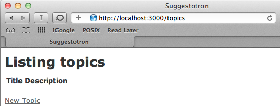

# CRUD With Scaffolding

## Goals
At the core, most database driven web sites are the same. They need to store records and provide a way to do the following:

* __C__reate new records in the database
* __R__ead or show the records in the database
* __U__pdate existing records
* __D__estroy or delete records

Because these 4 actions (CRUD) are so common, Rails includes the scaffold command to make creating them easier.

## Steps
### Step 1
Start running your project using the 'Run Project' button

  

__OR__ when running locally, instead of on cloud8 you can type this into your local terminal to start the rails server: `rails server`

### Step 2
Point your browser to the link displayed in the __Cloud9 Help__ tooltip box.  Mine is `https://suggestotron-joelbyler.c9users.io/`, but this time add `/topics` to the end of the url.

https://suggestotron-joelbyler.c9users.io/topics

__OR__ when running locally, you can use the following url `http://localhost:3000/topics`

You should see the "Listing topics" page with headers for title and description, and a link to add a new topic:

### Step 3
* Click "New Topic"
* Fill in the form and click "Create Topic"
* You should see a page showing your new topic with a message that your topic was successfully created:

### Step 4
* Click "Back"
* You should see the topic list again, this time with your new topic listed:

* Try the "Show", "Edit", and "Destroy" links to see what they do
* You've created a basic database driven web site, congrats!

## Explanation
How did all those pages get created and hooked together? The Rails scaffold did it for you.

Let's take a closer look at some of the files Rails created:

* `app/models/topic.rb`

  This file contains code for our topic model. If you look at it, it's nearly blank. Creating, reading, updating, and deleting records are built into Rails.

* `app/views/topics`

  * This folder contains all the views for our topics model. This is where the code for the forms you used above is stored. Rails created all of these pages as part of the scaffold.
  * If you've written HTML before, many lines in the views should look familiar. Rails views are HTML with some extra code added to display data from the database.
* `app/views/topics/index.html.erb`

  * This is the code for the page that lists all the topics.
  * Index is the name given to the "default" page for a web site or a section of a web site. When you navigate to http://localhost:3000/topics the topics index page is what is sent to your computer.

* `app/views/topics/show.html.erb`

  This is the page you get when you click the "Show" link on the "Listing topics" page.

* `app/views/topics/new.html.erb`

  This is the page you get when you click "New Topic".

* `app/views/topics/edit.html.erb`

  This is the page you get when you click "Edit".

* `app/views/topics/_form.html.erb`

  * You may have noticed that the page for new topics and the page to edit topics looked similar. That's because they both use the code from this file to show a form. This file is called a partial since it only contains code for part of a page. Partials always have filenames starting with an underscore character.
  * Challenge question: Can you find the line of code in new.html.erb and edit.html.erb that makes the form partial appear?

* `app/controllers/topics_controller.rb`

  * This is the controller file that Rails created as part of the scaffold
  * If you look you'll see a method (a line beginning with def) for each of the views listed above (except `_form.html.erb`)

## Next Step:
Go on to Setting The Default Page
