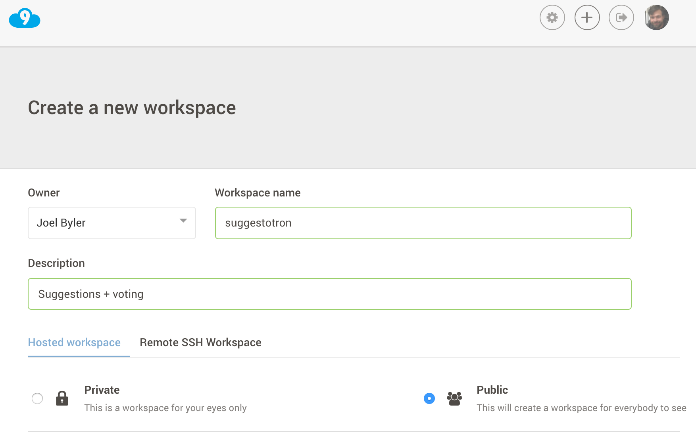
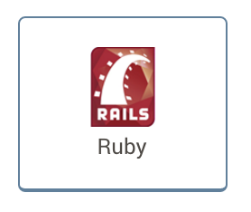

# Goals
* Create Your New Application

Let's get started! By the end of this step, we'll have a brand-spankin'-new (empty) Rails app and your cloud9 workspace ready for work.

## Steps
### Step 1

Login to cloud9

__Note__: This may require you to create a new account. The basic account is free, and all you should need for this example

### Step 2
Navigate to your dashboard (if you're not already there) and cick 'Create a new workspace'

### Step 3
* Project name will be `suggestotron`
* public project (private may be subject to fees)

  

### Step 4
* be sure to choose the `Rails` / `Ruby` template

  

### Step 5
* Click on the `Create workspace` button

You can see that cloud9 new created a lot directories and files. The ones we want to focus on today are:

File/Folder	| Purpose
----------- | --------
`app/` |	Contains the controllers, models, and views for your application. You will do most of your work here.
`config/`	| Configure your application's runtime rules, routes, database, and more.
`db/`	| Shows your current database schema, as well as the database migrations.
`public/` |	The only folder seen to the world as-is. If you put files in here, they will be served directly without any processing by Rails.
`app/assets/` |	This is where your images, JavaScript, stylesheets (CSS), and other static files should go. Modern Rails apps use something called the Assets Pipeline, which combines all the JavaScript and CSS files in this directory into a single file for speediness.
There is a lot more that rails new created. Probably enough to fill a book, so we're going to ignore them for now.

Next Step:
Go on to [Ruby Language](ruby_language.md)
