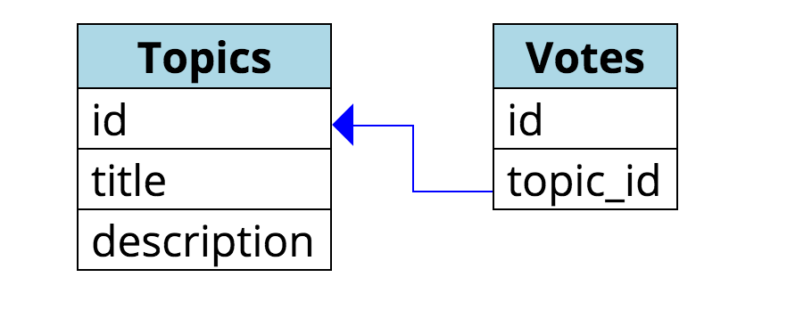
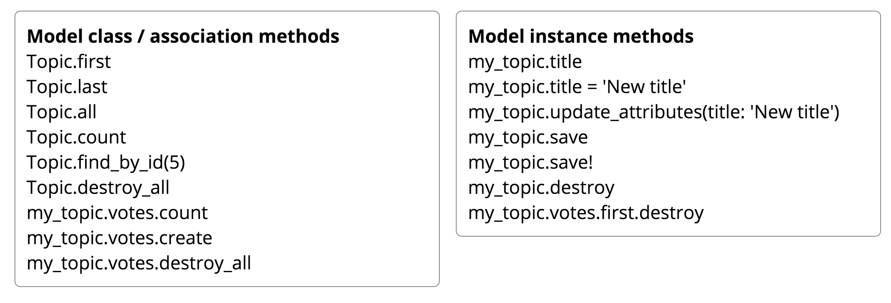

# Hooking Up Votes And Topics

## Goals
  

Because there is an explicit relationship between a topic and its votes, we need to specify that. In this step, we'll explicitly declare the relationship between votes and topics.

## Steps
### Step 1: Teach the Topic model about Votes
Edit `app/models/topic.rb` so that it looks like this:

```ruby
class Topic < ActiveRecord::Base
  has_many :votes, dependent: :destroy
end
```

### Step 2: Teach the Vote model about Topics
Edit `app/models/vote.rb` so that it looks like this:

```ruby
class Vote < ActiveRecord::Base
  belongs_to :topic
end
```

### Step 3: Play around with Topics and Votes in the Rails console
First, make sure you've made at least one topic on the site.

Next, open a Rails console in a terminal window:
```bash
rails c
```
Expected result:
```bash
$ rails c
Loading development environment (Rails 4.2.0)
2.1.5 :001 >
```
At the console, try the following things

See how many topics exist:

```ruby
Topic.count
```

Save the first topic into a variable:

```ruby
my_topic = Topic.first
```

---

`my_topic` here could have been any variable name, but we'll stick with `my_topic` for consistency.

---

Change the title of that topic to something else:
```ruby
my_topic.update_attributes(title: 'Edited in the console')
```

Add a vote to that topic:

```ruby
my_topic.votes.create
```

See how many votes that topic has:

```ruby
my_topic.votes.count
```

Remove a vote from that topic:

```ruby
my_topic.votes.first.destroy
```

Note that the things you can do to __Model classes__ (like __Topic__ and __Vote__), differ from the things you can do to __Model instances__ (like my_topic, here). __my_topic.votes__ is an __association__, and here behaves mostly like a model class.



An exhaustive list of things you can do to models and associations can be found in the [Active Record Query Interface RailsGuide](http://guides.rubyonrails.org/active_record_querying.html).

## Explanation
`has_many` and `belongs_to`:

* In Rails, relationships between models are called associations.
Associations (usually) come in pairs.
* A topic will have many votes so we put `has_many :votes` in the topic model.
  * When you ask a topic for its votes, you get an array of votes for that topic.
* A vote is for a particular topic, so we put `belongs_to :topic` in the vote model.
  * When you ask a vote for its topic, you get the topic for that vote.

It can still be important to clean up after yourself! `dependent: :destroy` on `has_many :votes` means when a __Topic__ gets destroyed, all the __votes__ that correspond to it will be destroyed, too. Without `dependent :destroy`, those votes would live on the database forever.

Next Step:
Go on to Allow People To Vote
