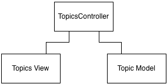

# Rails Architecture

## Goals
* Create a database table for topics with a title and a description

  In this step we'll learn a bit about Rails architecture. By the end of this step you should understand the following concepts:

  * Table
  * Model
  * View
  * Controller

## Explanation
__Rails architecture and its relation to the database__

Rails implements a very specific notion of the __Model/View/Controller__ pattern, which guides how you structure your web applications.

### Model

* For all the Models we create in RailsBridge, Model objects have a corresponding record in the the database. The name of the table in the database is the plural version of the Model's class name. For example, if the Model is called 'Duck', it will automatically query or write to the 'ducks' table in the database.
* Methods internal to Rails make it easy to automatically write records to the the database and query the database to get the records again later.
* The Model is a bridge between the database and your application's code.

### View

* The View generates the HTML that will be displayed in the browser.
* View files are written in ERB, a templating language. It contains HTML with Ruby code embedded in it. The ruby variables in the view stand as placeholders for content that will be filled in when a user requests the page.
* (There are several other templating languages available, but in RailsBridge we always stick to ERB.)

### Controller

* Controllers pass Ruby objects between the Models and the Views.
* Each url corresponds to a specific method in a Controller.
* After this step, when you visit any page in your application, that request will be handled by a method in a Controller.

When Models, Views and Controllers are all put together, they follow a pattern: Given a URL, Rails will look up which Controller method (also called an "Action") to use. The Controller Action will use methods in a corresponding Model. The Model will need to read or write to the database, and return an object containing that data to the Controller. The Controller will take that object and pass it to the View. (Actions normally have a corresponding View file, and Rails will automatically find and use that file.)

Models, Views and Controllers each have specific jobs. Separating responsibilities like this make it easier to develop, especially as it gets bigger. (When each file has a clear responsibility it's easier to fix problems and add new features.)

If you want to learn more about Rails Architecture, you may want to watch this video explanation (3 min 30 sec) [MVC architecture Youtube](https://www.youtube.com/watch?v=eTdVkgF_Slo)

Back to [Creating a Migration](creating_a_migration.md)
