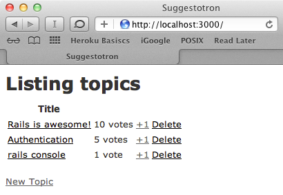

__IMPORTANT__: this material has been adapted from [railsbridge.org](http://docs.railsbridge.org/intro-to-rails/) to work on the [cloud9 IDE](http://c9.io)


# Intro To Rails

## Goal

To teach you Ruby on Rails we are going to use a "Real World" example. You've decided to create a voting system for you and your friends to play with. You've decided at a minimum, you'd like to allow users to:

* view the topics sorted by number of votes
* vote on topics
* create, edit, and destroy topics

You've sketched up an initial screenshot of what you want it to look like:

  

## Meta-Goal

When you have completed today's goal of getting the basic application online you should understand:

* Basic Ruby syntax
* How to try your Ruby code (IRB)
* How to go from requirements to a new working Rails application
* How to get your application online
* The basic tools a RoR (Ruby on Rails) developer uses (source control, editor, console, local server)

## Schedule

* 1-ish hour of Ruby
* 4-ish hours of Rails, broken up in 1-ish hour steps

This is just a rough guideline, not a mandate. Some steps you'll go over and some you'll go under. It'll all work out by the end of the day. Probably.

## Requirements

We're going to be working with:

* The Cloud9 online editor
  * you'll need have an account on [https://c9.io/](https://c9.io/)
* Heroku (optional)
  * you can create an account on [https://www.heroku.com/](https://www.heroku.com/)
* Github (optional)
  * you can create an account on [https://github.com/](https://github.com/)

If you can do that, you are probably good to go.

## Working Effectively and Efficiently
We highly recommend you do the following:

* Open your browser fresh or hide any windows you already have open.
  * Bring up one window with three tabs
  * One for this content
  * One for interacting with your app
  * One for the cloud9 browser based IDE
* Hide all extra applications. Turn off Twitter, Facebook, IM, and all other distractions.

By minimizing the number of things you interact with, you reduce the amount of time spent switching between them and the context lost as you work through the lessons. Having 50 tabs open in your web browser gets confusing.

## Format

Each lesson will look like this:

---
# Step Title

## Goal:
Description of the current step.

## Steps:
`steps to take.`
```ruby
def code_to_write
  1 + 1
end
```
These are steps that we're going to take, but we're not sure why, that comes next.

## Explanation
Details of what the steps actually did, explaining the cause and effect.

---

## Next Step:
Go on to [Getting started](getting_started.md)
