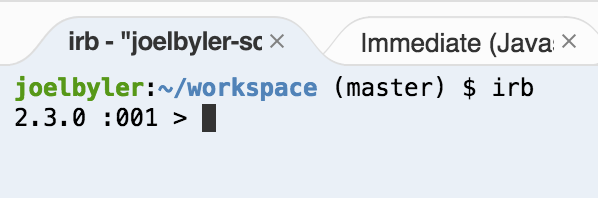
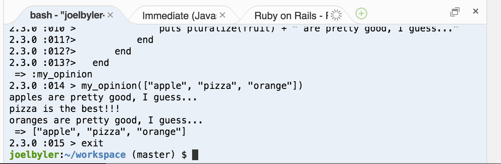

# Ruby Language

## Goals
* Be able to use the basic building blocks of Ruby code
* Use IRB to run Ruby code
* Do simple calculations
* Use and understand variables
* Use and understand arrays
* Use loops and conditional statements

## Steps
### Step 1
Type this in the bash tab to start the Interactive Ruby Shell, a program which lets you try out Ruby code:
```shell
irb
```

Yours might look different, but it should look something like this:
  

### Step 2
Next try some simple math that's built into Ruby. Type these lines into IRB:
```ruby
3 + 3
7 * 6
```

### Step 3
Variables are names with values assigned to them.

```ruby
my_variable = 5
```
This assigns the value `5` to the name `my_variable`.

### Step 4
You can also do math with variables:

```ruby
my_variable + 2
my_variable * 3
```
### Step 5
Variables can also hold more than one value. This is called an __array__.

```ruby
fruits = ["kiwi", "strawberry", "plum"]
```
Here we're using the variable `fruits` to hold a collection of fruit names.

### Step 6
Type this in the bash tab (aka terminal):
```ruby
fruits = fruits + ["orange"]
fruits = fruits - ["kiwi"]
```
`+` and `-` are called operators. We can use them with the array of fruits just like we can use them with numbers.

### Step 7
Everything in Ruby has a __class__. Type this into IRB:
```ruby
7.class
"kiwi".class
fruits.class
```
These are the three data types introduced so far: __Fixnum__ (numbers), __String__ (text), and __Array__ (lists).

### Step 8
Each class has different __methods__ that can be used on __instances__ of that class.
```ruby
fruits.length
fruits.first
```
You can see all the methods available for an object:

```ruby
fruits.methods
```
And __chain__ methods together:

```ruby
fruits.methods.sort
```
### Step 9
Arrays have a method called __each__ which iterates through the list running code on each item.

```ruby
fruits.each do |fruit|
  puts fruit
end
```
This takes the first item from the `fruits` array (`"strawberry"`), assigns it to the variable `fruit`, and runs the code between `do` and `end`. Then it does the same thing for each other item in the list. The code above should print a list of the fruits.

### Step 10
A __conditional__ runs code only when a statement evaluates to true.

```ruby
if my_variable > 1
  puts "YAY!"
end
```
This prints `YAY!` if the value stored in `my_variable` is greater than 1.

Try changing the `>` in the conditional to a `<`.

If you want to do something else when the statement evaluates to false, you can use an `else`:

```ruby
if my_variable > 1
  puts "YAY!"
else
  puts "BOO!"
end
```
### Step 11
You can also make your own methods:

```ruby
def pluralize(word)
  word + "s"
end
pluralize("kiwi")
```
Methods take __parameters__, which are the variables they work on. In this case, we made a method called pluralize that takes one parameter, a word.

Methods can also return data. In this case, pluralize returns the word with an 's' added to the end of it. In Ruby, methods return whatever the last line of the method evaluates to.

### Step 12
Putting it all together, let's make a method that says your opinion of some fruits:

__Don't try to type this all in!__ Just paste it into irb and see what happens.

```ruby
def my_opinion(fruits)
  fruits.each do |fruit|
    if fruit == "pizza"
      puts "pizza is the best!!!"
    else
      puts pluralize(fruit) + " are pretty good, I guess..."
    end
  end
end
my_opinion(["apple", "pizza", "orange"])
```
Try changing this method to say what your favorite fruit is.

***IMPORTANT:*** Before you move on to the next step you must exit IRB by typing 'exit'



## Next Step:
Go on to [Running Your Application](running_your_application.md)
