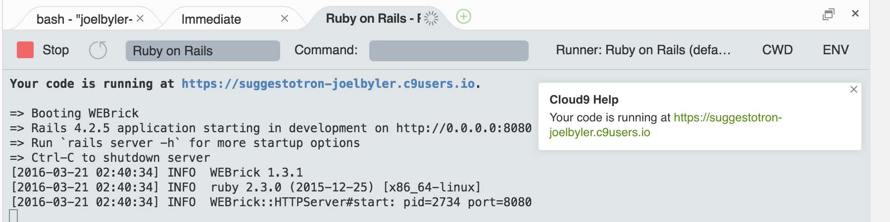

# Running Your Application Locally

## Goals
Let's fire up the application on the cloud9 servers

## Steps
### Step1
Click on the `Run Project` button at the top of the screen

  

This will print some stuff little `Ruby on Rails` tab at the bottom of your screen and stay running in there forever, printing more stuff every time you visit a page in your app.

### Step 2
Look for a little rectangular tool tip box in the lower right hand corner of the screen.  It should say something like "__Cloud9 Help__  Your code is running at http://suggestotron-yourusername.c9user.io" and click on that link.

### Step 3
This will open a new browser tab where you can see your web app actually running!

### Step 4
You can stop your app from running by pressing the `Stop` button with the red square next to it.

## Explanation
The `Run Project` button will start your application running on the public cloud9 server just like Heroku will be running it on their servers.  While this is running, others can also access the site to provide feedback if you share the address with them.

This provides a very simple means to see your changes before you commit and push them to Heroku.

Next Step:
Go on to Creating A Migration
