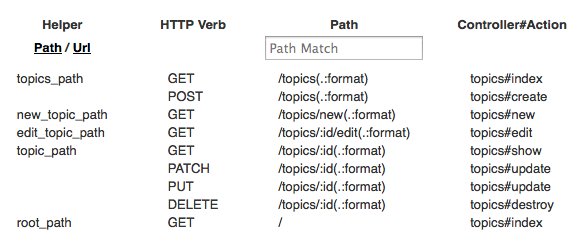

# Setting The Default Page

## Goals
Now that the structure is complete, let's make the flow work smoothly.

Currently when you run your project you see the "Welcome aboard" message by default.

It would be easier to use our app if it went directly to the topics list.

In this step we'll make that happen and learn a bit about routes in Rails.

## Steps
### Step 1: Add a root route
Locate and open the file `config/routes.rb`

Search the file for __root__, it should be near the top if you are using Rails 4

Uncomment the line that contains the example command by removing the # sign in front of it, and change it to read root 'topics#index'. When you are done the line should look like this:
```ruby
root 'topics#index'
```

### Step 2: Confirm your changes
Go back to your application (if its not running, you may need to use the 'Run Project' button) and refresh or press the link in the Cloud9 Help tooltip.

Explanation
* `root 'topics#index'` is a Rails route that says the default address for your site is `topics#index`. `topics#index` is the topics list page (the topics controller with the index action).
* Rails routes control how URLs (web addresses) get matched with code on the server. Similar to how addresses match with houses and apartments.
* The file `config/routes.rb` is like an address directory listing the possible addresses and which code goes with each one
* `routes.rb` uses some shortcuts so it doesn't always show all the possible URLs. To explore the URLs in more detail we can use the terminal.

At the terminal type `rake routes`. You should get something that looks like this:
```bash
$ rake routes

    Prefix Verb   URI Pattern                Controller#Action
    topics GET    /topics(.:format)          topics#index
           POST   /topics(.:format)          topics#create
 new_topic GET    /topics/new(.:format)      topics#new
edit_topic GET    /topics/:id/edit(.:format) topics#edit
     topic GET    /topics/:id(.:format)      topics#show
           PATCH  /topics/:id(.:format)      topics#update
           PUT    /topics/:id(.:format)      topics#update
           DELETE /topics/:id(.:format)      topics#destroy
      root GET    /                          topics#index
```

This shows all the URLs your application responds to. The code that starts with colons are variables so :id means the id number of the record. The code in parenthesis is optional.

In Rails 4, you can also get this information on your site while in development mode. Go to `/rails/info` (in my case https://suggestotron-joelbyler.c9users.io/rails/info/routes) and you'll see something like this:



You'll also see that table in Rails 4 whenever you try to access an invalid route (try `/sandwich`)

### Exploring Routes (optional)

Now you can have a look at the paths that are available in your app. Let's try looking at one of the topics routes we just generated. Open up your Rails console and play:

```bash
$ rails console
>> app.topics_path
=> "/topics"
>> app.topics_url
=> "http://www.example.com/topics"
```
`app` is a special object that represents your entire application. You can ask it about its routes (as we just did), play with its database connections, or make pseudo-web requests against it with `get` or `post` (and lots more).

## Next Step:
Go on to [Voting On Topics](voting_on_topics.md)
